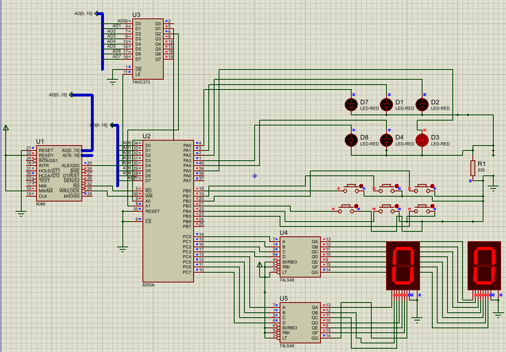

# Whack-a-Mole - Real 8086 Hardware with 8255 PPI

A fast-paced reaction-time game implemented in **Assembly Language** running on **Intel 8086 Processor** with an **Intel 8255A Programmable Peripheral Interface (PPI)** chip. The game challenges your reflexes as you "whack" (press buttons) for randomly appearing "moles" (LEDs) before they disappear.

This ran on actual embedded hardware with direct port I/O through the 8255 PPI.

## Project Overview

This is a hardware-level project featuring 6 LED "moles" that pop up (light) in random locations on the game board. The player must press the corresponding button for each lit mole before the timer expires. Each successful hit speeds up the game, and streaks of misses end the round. The final score is displayed in real-time on a 7-segment display.

### Game Mechanics

- **Random Mole Spawning**: A pseudo-random algorithm determines which of 6 LEDs lights up each round (the "mole")
- **Reaction-Based Gameplay**: 6 buttons correspond to the 6 LED positions for hitting moles
- **Score Tracking**: Displays the number of moles successfully whacked in real-time
- **Game Over**: Halts when rounds are over

## Hardware Setup

### 8255 PPI Port Configuration

The Intel 8255A is a classic 40-pin parallel interface chip with three 8-bit ports and a control register:

| Port | Address | Purpose | Mode | Details |
|------|---------|---------|------|---------|
| **PORTA** | 0FFF8H | LED Output | Output | 6 LEDs on bits 0-5 (pattern: 01H, 02H, 04H, 08H, 10H, 20H); bits 6-7 unused |
| **PORTB** | 0FFFAH | Button Input | Input | 6 push buttons on bits 0-5; bits 6-7 are "noise bits" (normally high/1) |
| **PORTC** | 0FFFCH | Score Display | Output | 7-segment display output (upper nibble = tens digit, lower nibble = ones digit) |
| **PORTCON** | 0FFFEH | Control Register | Config | Value **0x82** = Mode 0, PORTA output, PORTB input, PORTC output |

**8255 Control Word 0x82 Breakdown**:
- Bit 7 = 0: Mode Set Flag (sets port modes)
- Bits 6-5 = 00: Group B Mode 0
- Bit 4 = 0: PORTB as input
- Bit 3 = 0: PORTC upper as output
- Bits 2-1 = 01: Group A Mode 0
- Bit 0 = 0: PORTA as output

### Hardware Configuration

The real hardware board includes:
- **Intel 8086 CPU**: 16-bit processor running at standard clock speed
- **Intel 8255A PPI Chip**: Handles all I/O through three 8-bit parallel ports (A, B, C)
- **6 Red LEDs** (PORTA output) - arranged as "mole holes" in a 2×3 grid pattern
- **6 Momentary Push Buttons** (PORTB input) - one button per hole for the player to "whack" moles
- **Common Anode 7-Segment Display** (PORTC output) - displays hit score (0-99) in real-time
- **Current-Limiting Resistors**: ~330Ω per LED for safe operation
- **Pull-Up Resistors**: On PORTB for noise filtering and proper button detection
- **Software Debouncing**: Implemented in assembly with timing loops to filter noise from button presses

## File Structure

```
├── main.asm                           # Main assembly source code (8086, MASM/TASM compatible)
├── whack_a_mole.pdsprj                # Proteus File
├── proteus_schematic.png              # Schematic for the hardware
├── README.md               

```

## Real Hardware Implementation - Proteus Schematic



**Schematic Components:**
- **U1** (Left): Intel 8086 CPU with address bus (AD[0:15]) and data connections
- **U2** (Center): Intel 8255A PPI - the interface between CPU and I/O peripherals
- **D1-D6** (Top Right): 6 Red LEDs (PORTA output, bits PA0-PA5) - the "mole holes" that light up
- **Button Array** (Middle Right): 6 Push buttons (PORTB input, bits PB0-PB5) - player controls for hitting moles
- **U4 & U5** (Bottom Right): Two common-anode 7-segment displays - shows score in real-time (tens and ones digits)
- **Logic ICs**: 74HC373 (latch), 74LS48 (decoder) for address/data multiplexing
- **Address/Data Buses**: Blue signal lines connecting CPU to 8255 for bidirectional I/O

### Signal Routing (from Schematic)

**CPU to 8255 Interface:**
- **8086 Address Bus (AD[0:15])**: Selects which 8255 port is accessed (0FFF8H to 0FFFEH)
  - 0FFF8H = PORTA (LED output)
  - 0FFFAH = PORTB (Button input)
  - 0FFFCH = PORTC (7-segment display output)
  - 0FFFEH = PORTCON (Control register)

- **8086 Data Bus (D[0:7])**: Carries 8-bit I/O data between CPU and 8255

- **8086 Control Signals**: RD (Read), WR (Write), and RESET to 8255 control pins

**8255 Port Connections:**
- **PORTA (PA0-PA7)**: Directly drives 6 LEDs (PA0-PA5) through 330Ω current limiters
  - PA6-PA7: Unused (tied to ground via pull-downs)

- **PORTB (PB0-PB7)**: Reads 6 push buttons (PB0-PB5) with pull-up resistors
  - PB6-PB7: Noise filter bits (monitored for electrical noise)

- **PORTC (PC0-PC7)**: Drives two 7-segment displays (U4, U5)
  - PC0-PC3: Ones digit (display U4)
  - PC4-PC7: Tens digit (display U5)

---

## The Intel 8255A Programmable Peripheral Interface (PPI)

The **Intel 8255A** was the industry-standard parallel I/O chip for 8086/8088 systems. This project uses it as the bridge between the 8086 CPU and physical hardware.

### Why the 8255?

✅ **Three independent 8-bit ports** → Perfect for LEDs, buttons, and 7-segment display  
✅ **Simple control register** → Single byte (0x82) configures all ports at startup  
✅ **Direct IN/OUT instructions** → No special drivers or BIOS calls needed  
✅ **Fast I/O** → No wait states; ideal for reaction-time applications  
✅ **Proven reliability** → Industry standard since 1976; used in thousands of products  

### Port Mapping in This Project

```
8255 Chip Control Byte: 0x82

Bit 7  = 0  → Mode Set Flag (this is a mode word, not an I/O operation)
Bit 6-5= 00 → Group B Mode 0 (simple I/O)
Bit 4  = 0  → PORTB configured as INPUT
Bit 3  = 0  → PORTC lower nibble as OUTPUT
Bit 2-1= 01 → Group A Mode 0 (simple I/O)
Bit 0  = 0  → PORTA configured as OUTPUT
```


---

## Code Walkthrough

### Initialization
```asm
START:
    MOV AX, CS
    MOV DS, AX          ; Set up data segment
    JMP MAIN
```

### Main Game Loop
1. **MAIN**: Configures I/O ports (0x82 = PORTA output mode) and initializes
2. **GAME_LOOP**: 
   - Decrements countdown timer (RCNT) - shortens reaction time each round
   - Generates pseudo-random mole position using: `RIDX = (RIDX * RCNT + 7) mod 6`
   - Lights up an LED at the random position via PORTA (mole "pops up")
   - Waits for button press with timeout (~1 second for first mole, decreases each hit)
3. **HIT_CHECK**: Validates if the pressed button matches the lit mole position
   - Correct hit → Continue to next mole
   - Wrong button or timeout → Game ends
4. **ROUND_END**: Increments score and displays updated count on 7-segment display
5. **GAME_OVER**: Clears all LEDs and shows final score (moles whacked)

### Key Features

- **Pseudo-Random Generation**: Uses a linear congruential generator for LED sequencing
- **Debouncing**: Two reads of PORTB with a delay to filter electrical noise
- **Noise Filtering**: Treats 0xFFH (no press) and 0xC0H (noise bits) as idle states
- **Score Encoding**: Converts score (0-99) to BCD and displays in hex format via 7-segment display

## Difficulty & Progression

The game continuously ramps up difficulty with each successful whack:

```
Round 1:  RCNT = 0x52 (82 dec)  → ~1-2 second reaction window
Round 2:  RCNT = 0x51 (81 dec)  → Slightly faster
Round 3:  RCNT = 0x50 (80 dec)  → Even faster
...
Round N:  Reaction time continues decreasing until RCNT = 0x00
```

**Game Over Trigger**: When the counter reaches zero before the player hits the button—the "mole" ducks back down!

---

## Technical Specs

| Parameter | Value | Notes |
|-----------|-------|-------|
| Architecture | 8086 (16-bit) | Real-mode assembly |
| Code Size | ~500 bytes | Compact implementation |
| RAM Usage | ~10 bytes | Minimal variables: SCORE, RIDX, RCNT, LEDTAB |
| Initial Timeout | 0x52 cycles | ~82 game cycles (~1-2 seconds per round) |
| Debounce Delay | 0x0105 loops | ~260 microseconds (adjustable) |
| Difficulty Curve | Linear decrease | RCNT decrements each round |

## Game Rules

1. **Watch & React**: An LED lights up (a mole appears) at a random position
2. **Hit the Mole**: Press the button under the lit LED **before time runs out**
3. **Successful Hit**: Score increases by 1, next mole appears faster (difficulty increases)
4. **Miss or Wrong Button**: Game ends immediately
5. **Leaderboard**: Final score (number of moles whacked) displayed in real-time on 7-segment display

## Troubleshooting

| Issue | Solution |
|-------|----------|
| **LEDs not lighting at all** | Check +5V and GND connections; verify pull-down resistors on LED cathodes; test with multimeter |
| **Some LEDs don't light** | One or more LED may be blown; test individually with bench power supply; check series resistors |
| **Buttons not being detected** | Verify PORTB is in INPUT mode (control word 0x82); test with manual IN DX, AL from debugger; check pull-up resistors on button lines |
| **False button presses** | Increase debounce delay by raising `DLAY` or `DLAY_OUTER` loop counts; check for floating wires near buttons |
| **7-Segment display not showing score** | Verify display polarity (common anode vs cathode); check segment resistors; test display with direct +5V/GND |
| **Game runs too fast/slow** | Adjust `RCNT` initial value (0x52) - lower = faster difficulty ramp; calibrate against CPU clock frequency |
| **Game hangs or crashes** | Check EPROM burning integrity; verify 8255 chip is seated correctly; use debugger to step through code |
| **Intermittent button detection** | Add capacitors (0.1µF) near PORTB for noise filtering; check for loose button connections |
| **Incorrect control word** | Verify 0x82 is written to PORTCON (0xFFFEH); use debugger to read back control register |

## Future Enhancements

- **Difficulty Levels**: Adjustable game difficulty (beginner/intermediate/expert speeds)
- **Audio Feedback**: Buzzer or beep for successful hits and misses
- **High-Score Memory**: Store top scores in EEPROM for persistent leaderboard
- **Multi-Player Mode**: Alternating turns between 2-4 players
- **Visual Effects**: Blinking or pulsing LEDs for better "mole pop" effect
- **LCD Display**: Show real-time stats (hits, misses, combo streak)
- **Extended Play**: Endless mode or round-based game (e.g., "Whack 20 moles!")
- **Speed Ramp**: Exponential difficulty increase as rounds progress
